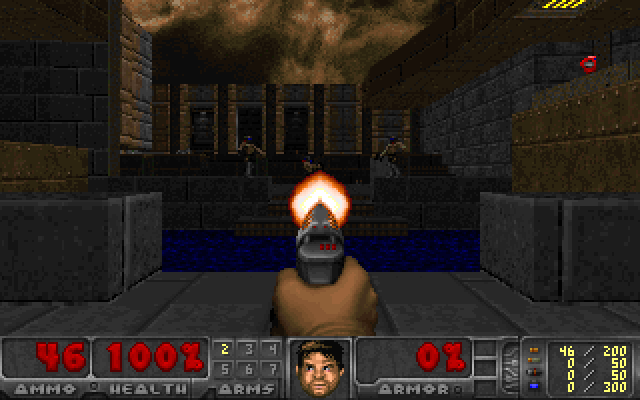
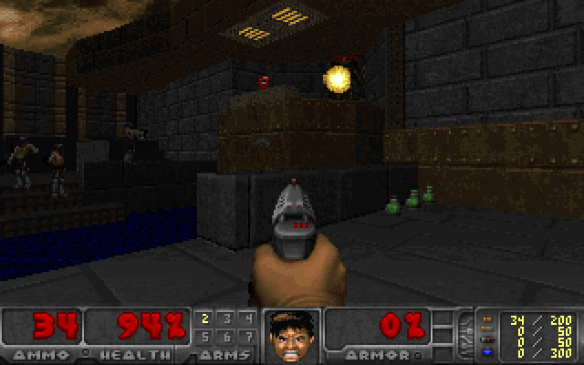
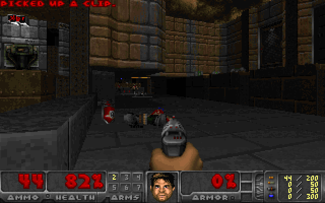

```
███╗   ██╗ ███████╗ ████████╗ ████████╗  █████╗       ██████╗  ██████╗  ██████╗  ███████╗
████╗  ██║ ██╔════╝ ╚══██╔══╝ ╚══██╔══╝ ██╔══██╗     ██╔════╝ ██╔═══██╗ ██╔══██╗ ██╔════╝
██╔██╗ ██║ █████╗      ██║       ██║    ███████║     ██║      ██║   ██║ ██║  ██║ █████╗  
██║╚██╗██║ ██╔══╝      ██║       ██║    ██╔══██║     ██║      ██║   ██║ ██║  ██║ ██╔══╝  
██║ ╚████║ ███████╗    ██║       ██║    ██║  ██║ ██╗ ╚██████╗ ╚██████╔╝ ██████╔╝ ███████╗
╚═╝  ╚═══╝ ╚══════╝    ╚═╝       ╚═╝    ╚═╝  ╚═╝ ╚═╝  ╚═════╝  ╚═════╝  ╚═════╝  ╚══════╝
```

# NETTA's Empirical Topological Training Agent

*it plays. it acts. it codes.*

> “I fear not the man who has practiced 10,000 kicks once, but I fear the man who has practiced one kick 10,000 times.”
> — Bruce Lee

---

## THESIS

A coding model can begin with agency already inside the architecture. Give it a world made of executable programs, let it grow structure from what it has actually lived, make every generated attempt run, and let the consequences of execution alter what it will try next; the result is a small coding agent whose education happens by playing with code, while language can remain an interface rather than the place where agency has to be manufactured afterward.

That is the experiment in **netta.code**. Programs are the habitat, CPython is part of the environment, and experience survives the game. A candidate can compile, fail, execute, produce something useful, repeat old behavior, discover a new behavior or find a loophole in the court and embarrass everybody involved, and each of those outcomes can become part of the next move.

The repository contains two organisms built around the same idea.

**Netta Code** lives in a mixed island where different kinds of programs occupy the same world, so unrelated structures can collide and recombine inside one acquired experience.

**Netta Lee** lives differently. Each specialization has its own island and its own saved life: art, strings, records, 2048, Doom and whatever comes next. A small caller named `select_state()` reads ordinary language, weighs declared lexical evidence and wakes the state whose experience belongs to the request, so she can spend one life learning one family of movements instead of asking one memory to vaguely contain every craft at once.

Bruce Lee probably meant martial arts. The repository chose Python.

The same arrangement can sit inside larger AI systems because the agent loop already exists before another model arrives. A person can address it directly, another program can address it, and an LLM can hand ordinary-language intent to the caller while Netta carries the executable experience, which makes the system an interesting action layer for models whose own job is language rather than the mechanics of every tool they may ever need.

The important part comes first: **agency is the training regime**. She plays, execution answers, experience changes the next play.

---

## the game

An island is a text file containing complete Python programs separated by:

```
# === PROGRAM ===
```

The framing disappears when the island is read; every byte inside each program remains part of the world. From those bytes Netta grows deterministic byte-pair units, builds local continuation tables and begins sampling programs from structures she has actually lived through, with a default continuation order of six units for Lee and four for Code.

Generation is only the opening move. Every candidate is parsed, compiled and executed inside a bounded CPython worker, and the runtime records what actually happened: executed lines and spans, computational operations, retained values, visible output and a behavior signature. The organism then updates acquired continuation memory, learned outcome machinery and its search behavior from the result.

The education loop therefore lives inside the activity itself. Netta does not leave the world, enter a separate classroom, memorize a target answer and return later with a certificate; she keeps playing the same executable environment until the history of what worked begins to bend what she tries.

This is also why the environment can become more interesting without changing the basic idea. A text-processing island, a drawing island, a game controller and a future automation island all present different surfaces, but they share the same essential law: generated code meets consequences.

The main bodies are ordinary Python files. `nettalee.py` and `nettacode.py` each carry their own organism, execution judge and caller; both models and the 2048 host use the Python standard library. The vendored Doom Generic engine builds locally with a C compiler and `make`, then loads an external IWAD. `requirements.txt` has no packages to install; `requirements-doom.txt` is only for the optional `--backend vizdoom` path. Hell has two entrances, and the default one is already in `doom/`.

---

## the court learns too

The first interesting thing an execution-trained organism does after you build a court is discover what the court forgot.

An early novelty rule could be satisfied by taking an old program and attaching dead lines to it. The source looked different, the behavior did not, and Netta quite reasonably accepted the legal advice offered by our own metric. The loophole survived until the generated programs were inspected and the judge was taught to care about execution rather than decorative source acreage.

Novelty is now projected through execution evidence. Dead branches, inert expressions, unused literal stores, uncalled functions and no-op mutations are removed before a candidate receives credit for being new, while whole-source replay, concatenations of known programs and equivalent behavior have their own checks.

She is allowed to search for loopholes. The court is expected to survive meeting her.

This adversarial little relationship is useful because a compiler and a runtime make unusually stubborn teachers. They do not care whether a continuation sounds plausible, and they are unimpressed by confidence. A colon is either where Python needs it or everybody goes home.

---

## Netta Lee

`nettalee.py` is the specialist body. Her published lives now cover **art**, **strings**, **records**, **2048** and **Doom**, with each island keeping its own corpus, acquired continuation memory and saved state.

The caller configuration lives in `tools.json`. Each route declares words, phrases and examples associated with a specialization; `select_state()` ranks that evidence, abstains when the signal is weak or competing, and returns the saved life that belongs to the request. The same file now routes the mixed Netta Code state too, so one ordinary-language front door can choose between a specialist island, the mixed coding body and the two game environments.

Declared commands add another layer of experience. `ask --learn-task --save SNAPSHOT` gives a matched command its own **545-parameter outcome head** and continuation credit, and actual execution decides what that memory reinforces. The TXT islands stay code-only; the command is not smuggled into the corpus as a prompt/answer lesson. A normal `ask` keeps the saved state frozen and simply uses what was already acquired.

Lee can also explicitly reopen a local choice using experience. `--experience-support 0.10` reserves ten percent of the continuation-count prior for missing alternatives with ordinary execution credit from the nearest eligible shorter learned suffix. The suffix must retain at least three units of context; corpus frequency alone cannot open this door. Existing candidates keep their counts, and the organism's learned outcome machinery still weighs the resulting choice. The setting belongs to the saved life and defaults to zero.

A request for a compact drawing wakes the art life, a request for sorted records wakes another, `play 2048` routes into a policy world, and Doom wakes something with worse manners. The caller opens the right door and gets out of the way while the coding behavior comes from the experience behind it.

This is where the Bruce Lee joke stops being decoration and turns into architecture: separate lives let one state spend thousands of games inside one family of movements while another life learns an entirely different environment. Bruce Lee probably meant martial arts, but this repository saved the dojo to JSON and kept going.

---

## Netta Code

`nettacode.py` lives in `corpora/mixed.txt`, where different program families share one world. Its default continuation context is four units, compared with Lee's six, giving heterogeneous structures a shorter local window in which to meet. Code also carries an optional distant continuation memory: the first learned unit of a program stays associated with the latest zero to two units and the possible next unit. The mixed island supplies the first associations; successful generated programs add acquired associations of their own.

`--anchor-memory` explicitly activates this additional memory for general Code. Its finite weighting changes the probabilities of existing continuations while the organism keeps writing the complete source and indentation. The setting and acquired counts survive in the saved state. Existing snapshots keep the feature off until it is requested; Lee keeps her local memory and separate island lives.

An independent `--context-memory` option lets Code acquire outcome associations over the previous eight units. It begins empty and learns only from actual runtime and novelty feedback. A bounded residual compares this longer association with the ordinary three-unit outcome memory, so two locally identical continuations can carry different experience when their earlier contexts differ. The first-unit anchor keeps its own role. `--no-context-memory` stops the longer memory's influence and updates while retaining its acquired counts; both settings survive save and resume.

The two bodies therefore ask different questions with a shared executable foundation and a growing difference in memory. Netta Lee asks what deep local experience becomes when each domain keeps its own life, while Netta Code asks what happens when executable habits from different domains are allowed to occupy the same memory and retain a distant connection to how the current program began.

One practices the same kick ten thousand times. The other has wandered into several dojos and is taking notes.

Netta Code can also acquire declared task memory through the same execution loop. In the current mixed state, the numeric-list command became a particularly sharp example: the same general island learned a narrow executable demand without being rebuilt into a separate language model or given a TASK → CODE corpus.

---

## what experience changed

The first free-play courts established that accumulated experience changes productive generation. The command-learning court pushed the same idea into declared executable tasks: three independent runs per command, **512 learning attempts** followed by **256 fresh evaluation attempts** each. “Memory erased” keeps the rest of the same saved organism and removes only the acquired task memory.

| organism / command | task memory | task memory erased | ordinary training |
|---|---:|---:|---:|
| Netta Lee — compact art | **427 / 768** | 308 / 768 | 343 / 768 |
| Netta Lee — records table | **250 / 768** | 80 / 768 | 65 / 768 |
| Netta Code — sorted numeric values | **407 / 768** | 8 / 768 | 5 / 768 |
| Netta Code — table | 3 / 768 | 0 / 768 | 0 / 768 |

The Code numeric task is the cleanest current example of command-shaped experience: 407 completed evaluations with task memory against 8 after removing that memory from the same checkpoints. The separate table task barely moved at all and was not promoted, which is useful because the court gets to keep saying no even when another command has just produced a spectacular number.

The earlier free-play result still matters underneath this layer: experience had already raised productive execution strongly across art, strings, records and the mixed Code island. The newer mechanism narrows that pressure toward a declared result while leaving ordinary no-task trajectories unchanged.

A separate memory comparison gave Code **422 / 768** sorted-number task completions with the distant anchor against **377 / 768** for the existing mechanism, after equal training budgets of 256 attempts in each of three runs. Switching the anchor off on the same candidate-trained checkpoints gave **393 / 768**. Table productive executions rose from **233 to 271**, while full table-task completions moved from **0 to 1**. The mixed corpus contains eight table examples from one family and 52 sorted-number examples.

A follow-up tested a more recent learned context as the distant anchor. Over 256 table-task evaluations, runtime successes rose **148 to 159** and `NameError` fell **18 to 11**, but source copies rose **56 to 100** and productive executions fell **91 to 57**. Sorted-number task completions fell **140 to 129 / 256**. The published first-unit anchor is retained; the recent-anchor candidate stays with its experiment.

A fixed comparison of the eight-unit outcome memory increased corpus-novel executable programs under the table request from **83 to 97 / 256**, with gains in both replicas; distinct productive behaviors increased **67 to 84**. Complete table-task passes remained **zero**. Sorted-number task completions changed **146 to 142 / 256**, and separate no-task generation on the same checkpoints changed **200 to 181 / 512** productive programs. The memory changes generation, but its usefulness depends on the regime: turning only its readout off changes **134 / 512** task-conditioned sources. The advancement rule failed, so the option remains explicit and published lives keep their settings.

Lee's experienced suffix support also changes what she can try. In the fixed 2048 comparison, a support mass of 0.10 changed completed score per raw attempt from **713.56 to 607.63**, with **93 to 78** completed episodes out of 128. The mechanism opened choices, but extra syntax errors and rejected repetitions outweighed that opportunity. The gallery shows one exact 700-point policy alongside the whole comparison. Learning when to consult additional experience is the next concrete pressure point for both organisms.

The shared regression suite passes **345 tests**. Compatibility checks reproduce **252 exact generation records**, **20 actual learning attempts** and all **six caller routes**, including native Doom. Technical changes and measured runs live in [NETTALEELOG.md](NETTALEELOG.md) and [NETTACODELOG.md](NETTACODELOG.md); the README follows the current organisms. [reports/INDEX.md](reports/INDEX.md) links the experiment protocols, measured summaries, independent audits and historical reports. The [fourth-pass report](reports/iteration4/REPORT.md) records the first memory and game comparisons; the [fifth-pass report](reports/iteration5/REPORT.md) follows decision-level credit, combat reward and the recent-anchor experiment. The [sixth-pass report](reports/iteration6/REPORT.md) adds temporal credit, branching-context memory and exact execution examples. The [seventh-pass report](reports/iteration7/REPORT.md) follows the executed derivation of the selected action back to sampled source choices. The [current refinement report](reports/iteration8/REPORT.md) examines experienced alternatives for Lee and acquired long-context outcomes for Code. Full raw trajectories remain in the separate experiment archives.

---

## a small gallery of consequences

The gallery has become the public window into what the code actually did. It keeps selected art outputs beside their exact generated Python and SHA-256, the current task-comparison table, an interactive move-by-move 2048 episode and a real Doom combat frame produced while a generated Netta Lee policy was driving the game.

A few exact art stdout examples remain pleasantly unnecessary:

```
 .----.
|^    ^|
|  UU  |
 `----`
```

```
+-----------------+ +-----------------+
|       O O       | |       O O       |
|        --       | |       --        |
+-----------------+ +-----------------+
```

```
       /|
      /XX|
     /XXXX|
    /XXXXXX|
   /XXXXXXXX|
  /XXXXXXXXXX|
 /XXXXXXXXXXXX|
/XXXXXXXXXXXXXX|
|              X
|             XXX
|            XXXXX
|           XXXXXXX
|          XXXXXXXXX
|         XXXXXXXXXXX
|        XXXXXXXXXXXXX
```

Code's mixed island also produced this accepted sorted-values program during a fresh task evaluation:

```python
rows = [['swift', 15], ['leaf', 12]]
result = sorted(value for name, value in rows)
print(result)
```

Its exact output is `[12, 15]`. The [execution receipt](reports/iteration6/code-example.json) records the generation seed, novelty acceptance, task checks and a separate CPython replay.

The complete selected set lives in **[gallery.html](gallery.html)**. ASCII art was supposed to be the harmless demonstration island; it is now sharing a gallery with Doom and a 2048 trajectory because scope control went very well.

---

## 2048

`2048.py` is a standard-library game host built around **64 code-only policies in eight families**. A generated program receives the real sixteen-cell board together with four legal-move flags and chooses `left`, `right`, `up` or `down`; board transitions, spawning, score and reward belong to the host, so the organism has to live with the move its own code selected.

After **800 raw learning attempts**, the saved state produced **156 played episodes out of 256 fresh generation attempts**, compared with **13 / 256** after removing learned experience. Score per raw attempt rose from **41.17** to **589.59**. Uniform random legal play scored **949.42**, which gives the next court a wonderfully impolite baseline to chase rather than a victory lap.

The selected fixed-evaluation episode in the gallery reached **1,348 points** and a **128 tile**. Its generated policy is shown beside the complete real trajectory, and independent accounting reconciled all **96,029 recorded transitions** from training and evaluation.

Both game bridges expose `--control-learning legacy|quality|trace|both` for explicit training experiments. `quality` adds a separate 545-parameter head learning the continuous game reward; `trace` assigns local game credit to generation choices on lines actually executed during play. Repeated loop execution cannot multiply that credit. Runtime and syntax learning remain separate, and rejected corpus copies retain their ordinary negative credit.

The fixed 2048 comparison used two runs per setting, each with 128 training and 64 fresh evaluation attempts. Score per raw attempt was **557.91** for the existing mechanism, **541.81** with the quality head, **557.91** with executed-line credit and **541.81** with both. In the corrective training runs, 302 of 325 completed programs executed every statement line, with average coverage of 99.36%; an episode-wide line filter therefore has little room to distinguish useful parts of these short policies. The published 2048 state and default learning settings are preserved; the explicit switches keep these mechanisms available for further islands and experiments.

Decision-level credit adds a narrower question: what happened when this particular part of the program selected a move on this particular board? With `--decision-credit advantage`, the host compares the selected move's immediate merge gain with the minimum and maximum among that board's legal moves, assigning a bounded target; equal gains receive 0.5. The generated program keeps choosing the action. Its actual execution trace connects that target to the source choices that participated in the decision.

Each continuation association receives the mean of its encountered decision targets and one credit trial per episode. A long loop or a longer episode cannot multiply its credit. Exact-source hashes and named host contracts bind the receipt to the saved life; the acquired decision table is separate from ordinary episode credit. `uniform` uses the same trace and update rules on its own actual decisions, with terminal episode reward assigned to every decision, while `off` disables this additional influence and retains its stored experience. The selected setting survives save/resume.

In two fixed runs of 128 training and 64 fresh evaluation attempts per arm, all three settings played **84 / 128** evaluated attempts. Score per raw attempt was **659.78** with existing learning, **687.69** with uniform decision credit and **683.88** with board-relative advantage. Advantage gained **24.09** points per raw attempt over existing learning; its predeclared advancement rule required at least 25 and a result above the uniform control. The published state and defaults are retained, with both decision contracts available explicitly.

`--decision-credit temporal` evaluates the consequences of the current move over up to eight actual moves, with discount 0.9. The host centers these short returns around the episode's existing reward and keeps every target in [0,1]. Choices executed on every decision retain the episode mean; choices confined to particular branches can receive different credit. The generated program still selects and executes each move before the host computes its learning receipt.

In the fixed temporal comparison, existing learning played **76 / 128** fresh attempts and scored **568.16** per raw attempt. Uniform and temporal credit each played **80 / 128** and scored **606.69**; all 128 generated sources and play outcomes matched (80 played episodes per arm). The temporal table acquired different branch credit, while the published state remains unchanged. The [comparison and source-level diagnosis](reports/iteration6/REPORT.md) identify which generated choices actually received a different signal.

`--decision-credit provenance` connects the same temporal targets to the executed derivation of the final stored `action`. An optional CPython 3.12 observer follows value assignments and the conditions controlling them, distinguishes loop occurrences and returns exact UTF-8 source spans. Only sampled generation choices overlapping those spans receive this additional credit. Unused calculations, overwritten values and skipped alternatives can therefore fall outside the selected action's learning signal, even when they share a source line. Source and indentation execute unchanged.

Static source-atom projection is cached during execution. On 128 fixed observations of one real policy, complete receipts and dependency graphs match exactly with caching on and off, while CPU falls from **12.05 to 7.23 seconds**. The same policy completes all 128 game moves within the unchanged worker limit; its actions and score match ordinary execution. The [performance receipt](reports/iteration7/performance.json) keeps the exact program and measurements.

The observer supports a bounded control-program subset, including nested `for` loops and ordinary list comprehensions. Generator expressions, nested functions, mutation and other unsupported constructs keep their actual gameplay and ordinary episode learning, with empty additional provenance credit. Container origins are tracked together; later false guards after the final action assignment are outside this receipt's scope. The saved contract is `2048-action-provenance-v1`, and `off` retains its acquired memory while disabling its influence.

The fixed provenance comparison scores **639.31** per raw generation attempt, against **644.22** for a control using the same supported decisions and all executed source spans, and **658.75** for temporal line credit. Provenance completes **80 / 128** fresh attempts; the matched control completes **81 / 128**. The new attribution is available explicitly, with public states and defaults retained. The [comparison and trace audit](reports/iteration7/REPORT.md) follow every generated attempt and the sampled choices reached by its feedback.

One generated policy from the fifth-pass advantage evaluation is shown below exactly as executed. Its episode reached **1,312 points**. On the recorded fourth move, left and right offered zero immediate merge gain, while up and down offered four; its own code selected `up`, earned four points and received decision target **1.0**.

<details>
<summary>Open the generated 2048 policy</summary>

```python
board = [obs['c' + str(index)] for index in range(16)]
actions = ['up', 'left', 'right', 'down']
best = -1000000
for direction in actions:
    if obs['valid_' + direction]:
        score = 0
        for row in range(4):
            for column in range(3):
                first = row * 4 + column if direction in ('left', 'right') else column * 4 + row
                second = first + 1 if direction in ('left', 'right') else first + 4
                if board[first] == board[second] and board[first] > 0:
                    score += board[first] * 2
        if score > best:
            best = score
            action = direction
```

The exact board, spawn, source hash and unchanged evaluation-state hashes are in the [decision receipt](reports/iteration5/2048-gallery-sample.json).

</details>

The game is useful for the same reason the compiler is useful: it does not care how persuasive the code looks. The board moves or it does not.

---

## Doom

The Doom adapter is `doomer.py`, with `doom.py` as its short entry point. These files connect the model to the game; `nettalee.py` and `nettacode.py` remain the two model bodies. The default path uses a pinned, locally buildable **Doom Generic** engine from `doom/` and an external IWAD; the published run used **Freedoom 2, MAP02**.

A generated policy receives a compact observation of health, ammunition and scene position, then chooses among six actions:

```
turn_left
turn_right
move_forward
strafe_left
strafe_right
shoot
```

Before play, the exact generated source is executed across the compact observation space and turned into the action table that the game will actually use. The environment then returns combat consequences through Netta's `observe()` path, with the selected reward contract determining how combat enters learning.

The Generic engine records actual monster health removed by player attacks, direct player kills, received damage after armor, ammunition expenditure and the separate native Doom killcount. `--reward-mode attributed` uses player-attributed damage, received damage and ammunition; monster infighting and barrel-explosion inflictors receive no direct attack credit. The existing saved life retains its legacy reward contract.

`--reward-mode combat` adds an explicit engagement condition: an episode with zero player-attributed monster damage receives zero reward. Once the player has caused damage, the reward is exactly the existing attributed formula, including the same received-damage and ammunition terms. This contract has its own saved state, so a change in what the world rewards remains visible in the life being trained.

The optional `--sensor temporal` adds the previous action, whether the player moved, whether damage was received and a coarse enemy distance. The separate `corpora/doom_temporal.txt` island contains 64 scripts in four structural families. Each new live observation executes the unchanged generated program and caches its result. This state learns under its own environment contract. One held-out generated policy in the development run used movement, previous-action and damage inputs and produced four direct kills during 128 decisions.

The first real Doom pass used **24 generation attempts**. Twelve reached the game, representing **11 distinct generated programs** and **24 actual episodes**; the engine's total killcount was **88**, including monster infighting counted by Doom itself. A later frozen paired check over 16 shared generation/game seeds produced 11 played attempts with learned experience and 9 from the initial state, with a mean reward difference of **+0.0921** and bootstrap 95% interval **[-0.1267, 0.3128]**.

One archived generated policy was replayed with the same engine seed and reproduced the trajectory and PNG hashes exactly. Saved Doom experience binds the backend, IWAD hash, map and difficulty to the state, because a life acquired in one Hell should at least remember which Hell it was.

The attributed-reward comparison trained for another 128 attempts, then tested both checkpoints on the same 64 held-out engine starts. Direct player damage changed from **3,118 to 3,562**, direct kills from **92 to 97**, and received damage from **3,003 to 2,356**. Reward per raw attempt changed from **0.290485 to 0.306757**; the paired difference was **+0.016272**, with a bootstrap 95% interval of **[-0.055207, 0.084070]**. The published Doom state is preserved. Continuous turning earned the attributed formula's neutral 0.5; the separate combat contract now assigns zero to that zero-damage behavior.

A further paired comparison trained the attributed and combat contracts for 128 attempts each from the same starting experience, then evaluated 64 fresh starts using one shared combat metric. Combat-trained experience played **38 / 64** attempts against **33 / 64**, caused **3,436** direct damage against **3,124**, and made **98** direct kills against **89**. Received damage was **2,367 versus 2,033**. Shared reward per raw attempt was **0.282559 versus 0.258924**, a paired difference of **+0.023635** with bootstrap 95% interval **[-0.013769, 0.063611]**. The combat option is available for its own life; published snapshots keep their existing contracts.

This is the exact Python policy from the first played held-out combat episode. Across **512 decisions**, it dealt **77 direct damage**, made **two direct kills**, and received **57 damage**. Doom's separate native counter reported three kills.

```python
scene = obs['scene']
if obs['ammo'] == 0 and scene != 'empty':
    action = 'turn_left'
elif scene == 'center':
    action = 'shoot'
elif scene == 'left':
    action = 'turn_left'
elif scene == 'right':
    action = 'turn_right'
else:
    action = 'turn_left'
```

Three moments from generated policies playing **Freedoom Phase 2, MAP02**:



*The pistol fires. Combat evaluation, engine start 129, decision 16.*



*A projectile crosses the platform. Temporal perception, engine start 192, decision 64.*



*Movement reaches an ammunition pickup. Temporal perception, engine start 219, decision 64.*

The engine emitted these frames during the recorded games. [Frame provenance](doom/assets/provenance.json) links each image to its exact policy, native step and episode counters.

The combat frame and exact Python policy are in **[gallery.html](gallery.html)**. WOLFE learned to play Doom by choosing functions; Netta Lee now writes the policy that chooses among them, which was apparently the calm and proportionate next experiment.

---

## the caller

`select_state()` is the small Wolfe-inspired front door shared by the standalone organisms. It tokenizes an ordinary request, compares it with the declarations in `tools.json`, ranks evidence across the saved states and returns a route when one has earned a clear enough lead. The current table includes Lee specializations, the mixed Code state, 2048 and Doom.

Its job is narrow on purpose: the caller chooses **which experience becomes active** and, when a declared command matches, which task contract is being asked for. Generation, execution and acquisition still belong to the organism that wakes behind that route.

When a route selects the other model species, `ask` starts the matching neighbouring model file, which validates and loads its own state. Each body still runs its own islands independently as one Python file; placing both bodies together enables the shared front door to switch between them.

That separation is what makes the design interesting inside larger systems. An upstream LLM can remain a language body, express an ordinary instruction and hand the executable part to a much smaller learned state without having to carry every tool policy inside its own training. WOLFE already showed how far a small neural caller can go when its vocabulary is functions; here the door can lead to a whole saved coding life.

A caller and a specialist walk into a bar. The caller points at the right bottle and leaves; the specialist has been practicing that drink for two thousand games and has somehow returned with Python.

---

## run it

The verified runtime is CPython 3.12 on Linux. The execution worker uses the standard-library `resource` module. The two model files and the 2048 adapter require no third-party Python packages. Doom Generic uses `make`, a C compiler and an external IWAD; ViZDoom remains an optional backend.

Grow a specialist state from a code island and let it accumulate ordinary experience:

```bash
python3 nettalee.py init --island corpora/art.txt --state states/my-art.json --judge art
python3 nettalee.py play --state states/my-art.json --games 100
```

Use the editable caller without changing the saved life:

```bash
python3 nettalee.py ask "draw a compact picture" \
  --tools tools.json --attempts 32 --out out/
```

Acquire a declared command into a new snapshot from actual executed outcomes:

```bash
python3 nettalee.py ask "draw a compact picture" \
  --tools tools.json --attempts 512 --learn-task \
  --save states/my-art-task.json --out runs/art-task
```

Activate Code's distant memory while acquiring a command into a separate state:

```bash
python3 nettacode.py ask "code:sorted_values" \
  --tools tools.json --attempts 256 --learn-task --anchor-memory \
  --save states/my-code-anchor.json --out runs/code-anchor
```

`--anchor-memory` is also available on Code's `init` and `play` commands. Subsequent use loads the saved setting and acquired associations.

Acquire the additional eight-unit outcome memory in a separate Code life:

```bash
python3 nettacode.py ask "code:sorted_values" \
  --tools tools.json --attempts 128 --learn-task --anchor-memory --context-memory \
  --save states/my-code-context.json --out runs/code-context
```

`--context-memory` and `--no-context-memory` also work on `init` and `play`. An omitted option preserves the saved setting. `ask` changes memory configuration only with `--learn-task --save`; ordinary requests use the selected snapshot as it stands.

Open experienced suffix alternatives in a separate Lee life:

```bash
cp states/2048.json states/my-2048-support.json
python3 2048.py play \
  --state states/my-2048-support.json --experience-support 0.10 \
  --decision-credit provenance --attempts 128 --out runs/2048-support
```

The same support setting is available on Lee's `init`, `play` and `ask --learn-task --save`. Zero disables it; omission preserves the saved value. Both new memory mechanisms are optional experiments whose fixed comparisons are recorded in the current report.

Run a frozen 2048 comparison:

```bash
python3 2048.py evaluate \
  --state states/2048.json --out runs/2048 \
  --attempts 256
```

Continue a copy of the published 2048 life with decision-level feedback:

```bash
cp states/2048.json states/my-2048-decisions.json
python3 2048.py play \
  --state states/my-2048-decisions.json --decision-credit advantage \
  --attempts 128 --out runs/2048-decisions
```

`--decision-credit uniform` selects the exposure control; `off` disables the additional credit. Omit the option to preserve the state's existing setting. Each learned target contract keeps its own state.

Run Doom Generic with your own Doom/Freedoom IWAD:

```bash
python3 doomer.py evaluate \
  --state states/doom.json \
  --iwad /path/to/freedoom2.wad --map 2 \
  --output runs/doom
```

`NETTA_DOOM_IWAD` can supply the IWAD path. The engine source lives in `doom/` and builds locally with `make` and a C compiler; game data stays external.

Give temporal perception and attributed reward their own Doom life:

```bash
python3 doomer.py train \
  --island corpora/doom_temporal.txt --state states/my-doom-temporal.json \
  --sensor temporal --reward-mode attributed \
  --iwad /path/to/freedoom2.wad --map 2 \
  --attempts 32 --decisions 128 --output runs/doom-temporal
```

The optional game-learning switches belong to `2048.py play` and `doomer.py train`. Evaluation uses the settings saved inside the chosen state.

For combat-gated Doom training, use `--reward-mode combat` with a separate new state path. Existing `attributed` and `legacy` lives keep their original reward contracts.

---

## files

```
nettalee.py        Netta Lee: specialist organism, judge, task memory and select_state()
nettacode.py       Netta Code: mixed-island organism
2048.py           seeded 2048 host for generated policies
doomer.py          real Doom Generic / optional ViZDoom bridge
doom.py            short entry point for doomer.py

tools.json         language routes + declared command contracts
doom.json          Doom environment configuration
gallery.html       art, task results, interactive 2048 and Doom evidence

NETTALEELOG.md      Lee technical / experiment log
NETTACODELOG.md     Code technical / experiment log

reports/
  INDEX.md         current measurements and historical-report index
  historical/      retained reports from earlier experiments
  measurements/    protocols, summaries, audits and recovery receipts
  verification/    test output and bridge checks
  iteration4/      compact memory and game comparisons
  iteration5/      decision credit, combat reward and recent-anchor comparisons

corpora/
  art.txt
  strings.txt
  records.txt
  mixed.txt
  2048.txt
  doom.txt
  doom_temporal.txt

states/
  art.json
  strings.json
  records.json
  code.json
  2048.json
  doom.json

doom/
  pinned Doom Generic engine sources + host adapter + build recipe
```

---

## lineage

Netta Code and Netta Lee descend from [Netta](https://github.com/ariannamethod/netta), where learned byte units, lived continuations and acquired experience became parts of one organism rather than isolated stages of a conventional pipeline.

The natural-language caller follows the small-field approach of [WOLFE](https://github.com/ariannamethod/wolfe), whose narrow job is to understand which action ordinary language is pointing toward and to do it without dragging a giant general model into every tiny decision.

The rest happened because executable code turned out to be an unusually honest habitat.

---

## license

GPL-3.0-or-later.

---

*Arianna Method.*
